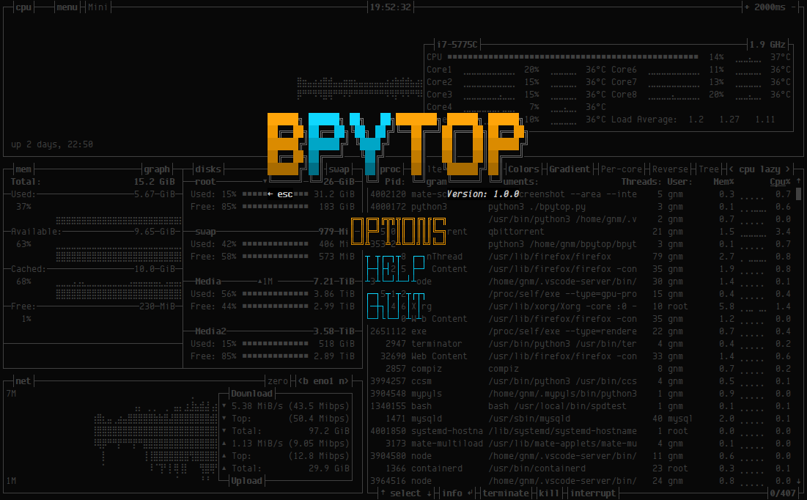

# 


[](https://paypal.me/aristocratos)
[](https://github.com/sponsors/aristocratos)
[](https://ko-fi.com/aristocratos)

## Index

* [Documents](#documents)
* [Description](#description)
* [Features](#features)
* [Themes](#themes)
* [Support and funding](#support-and-funding)
* [Compatibility](#compatibility)
* [Dependencies](#dependencies)
* [Screenshots](#screenshots)
* [Installation](#installation)
* [Configurability](#configurability)
* [TODO](#todo)
* [License](#license)

## Documents

#### [CHANGELOG.md](CHANGELOG.md)

#### [CONTRIBUTING.md](CONTRIBUTING.md)

#### [CODE_OF_CONDUCT.md](CODE_OF_CONDUCT.md)

## Description

Resource monitor that shows usage and stats for processor, memory, disks, network and processes.

Python port of [bashtop](https://github.com/aristocratos/bashtop).

## Features

* Easy to use, with a game inspired menu system.
* Fast and responsive UI with UP, DOWN keys process selection.
* Function for showing detailed stats for selected process.
* Ability to filter processes.
* Easy switching between sorting options.
* Send SIGTERM, SIGKILL, SIGINT to selected process.
* UI menu for changing all config file options.
* Auto scaling graph for network usage.
* Shows message in menu if new version is available
* Shows current read and write speeds for disks

## Themes

Bpytop uses the same the files as bashtop.

See bashtop/[themes](https://github.com/aristocratos/bashtop/themes) folder for available themes.

The builtin theme downloader places the default themes in `$HOME/.config/bpytop/themes`.
User created themes should be placed in `$HOME/.config/bpytop/user_themes` to be safe from overwrites.

Let me know if you want to contribute with new themes.


## Support and funding

You can sponsor this project through github, see [my sponsors page](https://github.com/sponsors/aristocratos) for options.

Or donate through [paypal](https://paypal.me/aristocratos) or [ko-fi](https://ko-fi.com/aristocratos).

Any support is greatly appreciated!

## Compatibility

Should work on most modern linux distributions, on Mac OS X and on FreeBSD.

Will not display correctly on the standard terminal on OSX!
Recommended alternative [iTerm2](https://www.iterm2.com/)

Will also need to be run as superuser on OSX to display stats for processes not owned by user.

The disk io stats on OSX and FreeBSD shows iostats for all disks at the top instead of per disk.

For correct display, a terminal with support for:

* 24-bit truecolor
* Wide characters

Also needs a UTF8 locale and a font that covers:

* Unicode Block “Braille Patterns” U+2800 - U+28FF
* Unicode Block “Geometric Shapes” U+25A0 - U+25FF
* Unicode Block "Box Drawing" and "Block Elements" U+2500 - U+259F

#### Notice

Dropbear seems to not be able to set correct locale. So if accessing bashtop over ssh, OpenSSH is recommended.

## Dependencies

**[Python3](https://www.python.org/downloads/)** (v3.6 or later)

**[psutil module](https://github.com/giampaolo/psutil)** (v5.7.0 or later)

## Optionals for additional stats

(Optional OSX) **[osx-cpu-temp](https://github.com/lavoiesl/osx-cpu-temp)** Needed to show CPU temperatures.

## Screenshots

Main UI showing details for a selected process.


Main menu.


Options menu.


## Installation

#### Dependencies installation OSX

>Install homebrew if not already installed

``` bash
/bin/bash -c "$(curl -fsSL https://raw.githubusercontent.com/Homebrew/install/master/install.sh)"
```

>Install python3 if not already installed

``` bash
brew install python3 git
```

>Install psutil python module
``` bash
pip3 install psutil
```

>Install optional dependency osx-cpu-temp

``` bash
brew install osx-cpu-temp
```

#### Dependencies installation FreeBSD

>Install with pkg and pip

``` bash
sudo pkg install python3 git
sudo python3 -m ensurepip
sudo pip3 install psutil
```

#### Manual installation Linux, OSX and FreeBSD

>Clone and install

``` bash
git clone https://github.com/aristocratos/bashtop.git
cd bashtop
sudo make install
```

>to uninstall it

``` bash
sudo make uninstall
```


## Configurability

All options changeable from within UI.
Config files stored in "$HOME/.config/bpytop" folder

#### bashtop.cfg: (auto generated if not found)

```bash
#? Config file for bpytop v. 0.0.1
#* Color theme, looks for a .theme file in "~/.config/bpytop/themes" and "~/.config/bpytop/user_themes", "Default" for builtin default theme
color_theme = "Default"

#* Update time in milliseconds, increases automatically if set below internal loops processing time, recommended 2000 ms or above for better sample times for graphs
update_ms = 2500

#* Processes sorting, "pid" "program" "arguments" "threads" "user" "memory" "cpu lazy" "cpu responsive"
#* "cpu lazy" updates sorting over time, "cpu responsive" updates sorting directly
proc_sorting = "cpu lazy"

#* Reverse sorting order, True or False
proc_reversed = False

#* Show processes as a tree
proc_tree = False

#* Check cpu temperature, only works if "sensors", "vcgencmd" or "osx-cpu-temp" commands is available
check_temp = True

#* Draw a clock at top of screen, formatting according to strftime, empty string to disable
draw_clock = "%X"

#* Update main ui when menus are showing, set this to false if the menus is flickering too much for comfort
background_update = True

#* Custom cpu model name, empty string to disable
custom_cpu_name = ""

#* Show color gradient in process list, True or False
proc_gradient = True

#* If process cpu usage should be of the core it's running on or usage of the total available cpu power
proc_per_core = False

#* Optional filter for shown disks, should be names of mountpoints, "root" replaces "/", separate multiple values with space
disks_filter = ""

#* Enable check for new version from github.com/aristocratos/bpytop at start
update_check = True

#* Enable graphs with double the horizontal resolution, increases cpu usage
hires_graphs = False
```

#### Command line options: (not yet implemented)

``` bash
USAGE: bpytop

```

## TODO

- [ ] See TODOs from [Bashtop](https://github.com/aristocratos/bashtop#todo).

## LICENSE

[Apache License 2.0](LICENSE)
